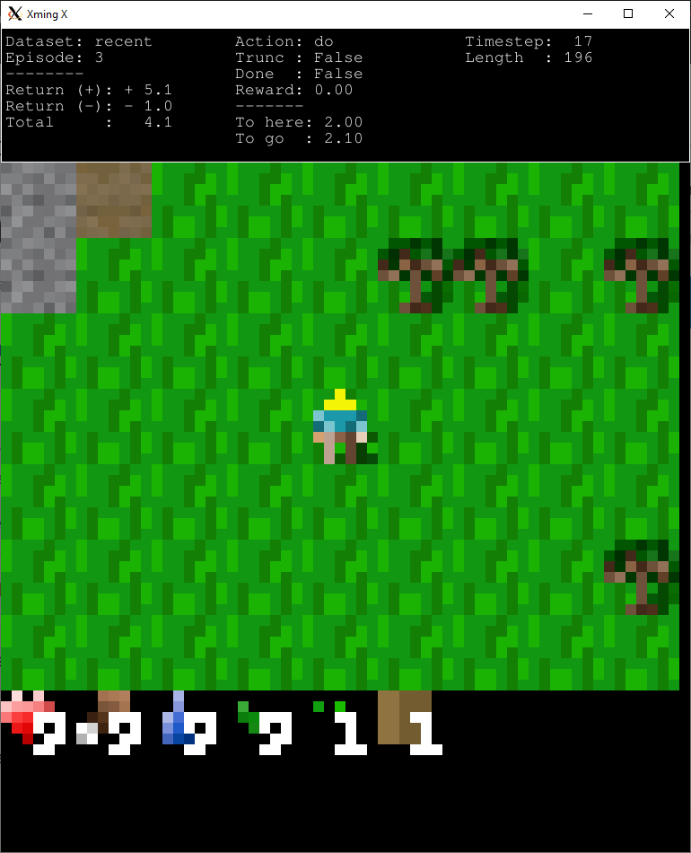

# Static Data Collection for World Models

This repository contains code to collect random trajectories in the [Crafter](https://github.com/danijar/crafter) game and visualize the resulting dataset.

At the moment, the random trajectories follow a **fixed hand-crafted policy**, leading to a **static dataset**.

<p align="center">
  
</p>

## Credits and modifications
The code is originally from a private git branch leading to the [DIAMOND](https://github.com/eloialonso/diamond) project, made by [Eloi Alonso](https://eloialonso.github.io) and [Vincent Micheli](https://vmicheli.github.io) and was modified by [Stéphane Nguyen](https://zenchiyu.github.io).

Modifications include
- We removed the RL agent and world model. PyTorch models are no longer used in the data collection.
- Renamed:
  - `trainer` to `collector`, as there are no PyTorch models to train.
  - `play` to `explore` and `game` to `visualizer`, as we can no longer play inside the world model.
- We can now retrieve the Crafter terrain (code inspired by [`run_terrain.py` from Crafter](https://github.com/danijar/crafter/blob/e04542a2159f1aad3d4c5ad52e8185717380ee3a/crafter/run_terrain.py)). For a vectorized gymnasium environment `env`, we need to use `env.unwrapped.call("get_map", episode=ep)`.
- We can now visualize some agent trajectories in `trajectories.py` (WIP).

## BibTeX

If you find this code useful, please use the following reference, as it is a work resulting from the [IRIS](https://github.com/eloialonso/iris) project:

```
@article{iris2022,
  title={Transformers are Sample Efficient World Models},
  author={Micheli, Vincent and Alonso, Eloi and Fleuret, François},
  journal={arXiv preprint arXiv:2209.00588},
  year={2022}
}
```

## Setup

- Install [PyTorch](https://pytorch.org/get-started/locally/) (torch and torchvision). Code developed with torch==1.11.0 and torchvision==0.12.0.
- Install [other dependencies](requirements.txt): `pip install -r requirements.txt`
- Warning: Atari ROMs will be downloaded with the dependencies, which means that you acknowledge that you have the license to use them.

## Launch a collection run

- For the Crafter game:
```bash
python src/main.py common.device=cuda:0 collection.num_envs=<num_envs> collection.num_steps_total=<num_steps_total>
```
where `num_envs` is the number of environment copies (trajectories within the same map), and `num_steps_total` is the number of frames we want to collect.

**Import remark:** At each episode, a new map is generated, since [VectorEnv](https://gymnasium.farama.org/api/vector/#gymnasium-vector-vectorenv) autoresets sub-environments, and because of the way the [Crafter](https://github.com/danijar/crafter/blob/e04542a2159f1aad3d4c5ad52e8185717380ee3a/crafter/env.py#L74) game resets.

**WIP:** Logs are not yet synced with [weights & biases](https://wandb.ai). We set `wandb.mode=disabled` by default.

## Configuration

- All configuration files are located in `config/`, the main configuration file is `config/collector.yaml`.
- The simplest way to customize the configuration is to edit these files directly.
- Please refer to [Hydra](https://github.com/facebookresearch/hydra) for more details regarding configuration management.

## Run folder and visualizer

Each new run is located at `outputs/YYYY-MM-DD/hh-mm-ss/`. This folder is structured as:

```txt
outputs/YYYY-MM-DD/hh-mm-ss/
├── config
│   └── collector.yaml
├── dataset
│   └── recent
├── main.log
├── src
│   ├── collector.py
│   ├── collect.py
│   ├── data
│   ├── env_loop.py
│   ├── envs
│   ├── explore.py
│   ├── __init__.py
│   ├── main.py
│   ├── utils.py
│   └── visualizer
```
- `dataset`: contains the collected dataset in the format described in the `src/data` directory.

### Visualizer:
**From the run folder**, you can run `python ./src/explore.py` to **visualize** the episodes contained in `dataset/recent` (`src/explore.py` was previously called `src/play.py`).
  - Adding `--no-header` to the command will ignore the header.
  - Adding `--fps <number>` to the command will change the PyGame frame rate.
  - In the visualizer, you can perform the following actions:
    ```
    Actions (macro):

    ESC/q : quit
    ⏎ : reset env
    m : next dataset
    ↑ : next episode
    ↓ : previous episode

    Actions (micro):

    → : next frame
    ← : previous frame
    page up: skip 10 frames
    page down: go back 10 frames
      ```

## Credits

- [https://github.com/eloialonso/iris](https://github.com/eloialonso/iris)
- [https://github.com/eloialonso/diamond](https://github.com/eloialonso/diamond)
- [https://github.com/danijar/crafter](https://github.com/danijar/crafter)
- [https://github.com/pytorch/pytorch](https://github.com/pytorch/pytorch)